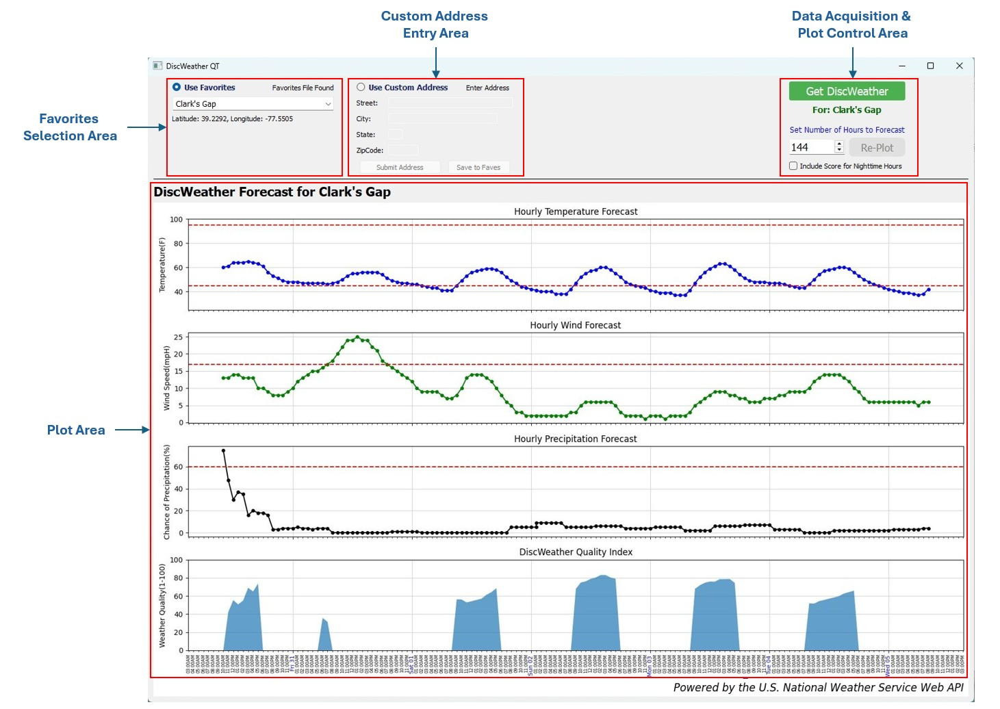
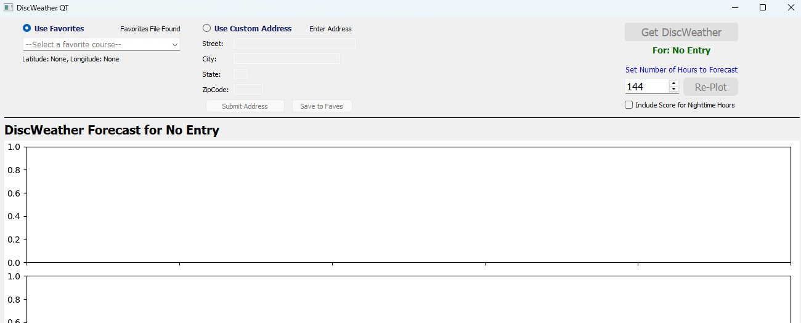
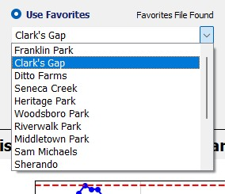
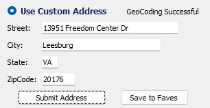
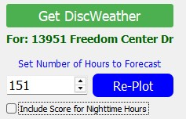
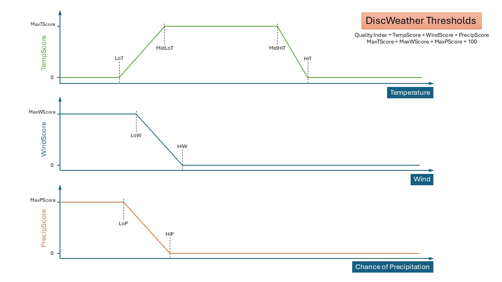

# DiscWeatherQT: Weather Quality Prediction for Disc Golf

## About DiscWeather

DiscWeatherQT is a Python script with a PyQt5 User Interface that gathers and displays the 6-day weather forecast for a specified location, then uses daylight, temperature, wind and chance of precipitation data to generate an hourly "Disc Weather Quality Index" to help users understand the most favorable upcoming time periods for disc golf at that location. 

The hourly Quality Index calculations range between 0 and 100 with 100 representing absolutely ideal weather conditions for disc golf 😎, and 0 indicating conditions in which one would very likely not enjoy playing disc golf at all 😒. The Quality Index calculation can be tuned through a variety of settings and thresholds as described further below.

Hourly forecast data are pulled from the U.S. National Weather Service Web API, and geocoding data for user-entered addresses are pulled from the U.S. Census Bureau Geocoder API.

## Requirements

To run the DiscWeather program on your computer, you must:

* Be able to access a command-line interface, such as Terminal for Mac or CMD prompt for Windows
* Have [Python](https://www.python.org/downloads/) version 3.13 or later installed, 
* Have the following Python packages installed using pip or a similar package manager:
    * sys
    * requests
    * json
    * matplotlib
    * dateutil
    * PyQt5
* Have the files "DiscWeather.py", "dwConfig.py" and "favorites.txt" in the same directory.


## Usage

**To run DiscWeather using the [DiscWeather.py](DiscWeather.py) file:**

1. Open a command-line interface and navigate to the folder where `DiscWeather.py` is stored.
2. Type the following command: `python DiscWeather.py`
3. Press the "Enter" key

## The Program
The UI is comprised of 4 functional areas:
1. The Favorites Selection area, where a favorite course can be selected from the courses contained in the "favorites.txt" file, if it exists.
2. The Custom Address Entry area where a new address can be entered and geocoded. Successfully geocoded addresses can also be added to Favorites in this area.
3. The Data Acquisition / Plot Controls area where the selected course (from Favorites or Custom Address sections) can be used to acquire and plot DiscWeather forecast data.
4. The Plot Area, where hourly temperature, wind, chance of precipitation and DiscWeather Quality Index data are plotted.




On initial start-up, the UI will show the Favorites, Custom Addresss and Data Acquisition / Plot Controls areas, but the Plot Area will contain no data. To enable retrieval and plotting of course forecast data, a course must first be selected either from the Favorites List or by entering a valid U.S. Continental address. 



Use of the Favorites and Custom Address areas is mutually exclusive as controlled by the associated radio buttons. Selecting the "Use Favorites" radio button allows the user to pick a favorite course from the associated Combo Box, and the fields associated with the "Use Cusom Address" radio button are not enabled.  Likewise, when the "Use Custom Address" radio button is selected, the user can enter a custom address, submit it for geocoding, and save successfully geocoded address, latitude and longitude to their favorites list, but the Favorites Combo Box will not be active.

Once a course has been selected either from Favorites or by submitting a valid address, then the "Get DiscWeather" button will be enabled.  Selecting this button will retrieve hourly forecast information for the selected course from the free U.S. National Weather Service Web API (no API account / key required) and plot the relevant data in the plot area.

### The Favorites Area
If the "Use Favorites" radio button is selected, the user can then use the Favorites Combo Box to select from their saved list of favorite courses.  If the "favorites.txt" file does not exist in the same directory as the "DiscWeatherQT.py" file, then the Combo Box will not be active and no course can be selected in this section - the "Use Custom Address" UI area must be used instead.



Note that if the user elects to save a valid address to favorites in the Custom Address area, then the Favorites Combo Box will be populated with the new course. The Combo Box will be activated the next time the user selects the "Use Favorites" radio button.

### The Use Custom Address Area
If the "Use Custom Address" radio button is selected, the user can then enter a valid continental U.S. address by way of the Street, City, State and ZipCode text entry boxes. 



Once the address fields have been correctly filled in, the "Submit Address" button is enabled. Selecting the "Submit Address" button will submit the entered address for geocoding using the U.S. Census Bureau Geocoder API. Invalid or non-continental U.S. addresses will fail the Geocoding test and users will be notified that the address is invalid. Edit the address fields appropriately and resubmit until geocoding is successful.

Successful geocoding of the entered address will return the latitude and longitude corresponding to the address. The lat/long values are necessary for subsequent retrieval of weather forecast data from the U.S. National Weather Service Web API.

Once an address has been successfully geocoded, the "Save to Faves" button is activated. On selection of this button, the recently geocoded street address, latitude and longitude will be saved to the "favorites.txt" file and made available in the Favorites Combo Box.

### The Data Acquisition & Plot Control Area
Once a course has either been selected from Favorites or entered / geocoded in the Custom Address section, the "Get DiscWeather" button will be enabled in the Data Acquisition & Plot Control area.



Selecting the "Get DiscWeather" button will submit the course latitude and longitude to the U.S. National Weather Service Web API and retrieve the weather forecast for the location for the next 156 hours.  This data will be used to calculate the hourly DiscWeather Quality data which will then be plotted alongside temperature, wind speed, and chance of precipitation across the forecast period in the Plot area.

After initial plotting of data, the user can update the number of forecast hours of data to be displayed by modifying the value in the "Hours to Forecast" spin box. (Use the up/down arrows to adjust, or enter the value directly with mouse and keyboard.) The number of hours entered must be between 12 and 156, inclusive.

Selecting the "Include Score for Nighttime Hours" checkbox will update the DiscWeather Quality Index plot to show nighttime hours for Glow Disc Golfing.

## Settings and Configuration:
DiscWeather Quality Index calculations are governed by settings and thresholds contained in the [dwConfig.py](dwConfig.py) file, an example of which is shown below:

```python
# dwConfig.py contents
numHours = 144          # Number of hours to plot: (from 12 to 156)
daylightOnly = True     # Set to false to allow night predictions for glow disc play

# Thresholds for calculating hourly DiscWeather scores:

LoT = 45        # Below which overall score will be 0. Above which score increases to max at MidLoT
MidLoT = 65     # Above which temp score will be max until MidHiT is reached
MidHiT = 85     # Above which temp score decreases to 0 at HiT
HiT = 95        # Above which overall score will be 0
LoW = 8         # Below which wind score will be Max. Wind score decreases to 0 at HiW
HiW = 17        # Above which overall score will be 0
LoP = 19        # Below which precip score will be Max. Precip score decreases to 0 at HiP
HiP = 65        # Above which overall score will be 0

# Relative contributions for temperature, wind and precipitation to overall Quality Index:
MaxTScore = 40
MaxWScore = 35
MaxPScore = 100 - (MaxTScore + MaxWScore)
# The total for all 3 maximum sub-scores must add up to 100.
```

Below is a visual representation of how the individual scores are generated using the settings/threshold parameters for temperature, wind and precipitation respectively.  



When modifying settings and thresholds in "dwConfig.py", keep in mind that threshold values must have logically correct relative values for each sub-score calculation to execute. 

Specifically, the following ordinal relationships for thresholds must be met:
* *Temperature Score:* LoT < MidLoT <= MidHiT < HiT
* *Wind Score:* LoW < HiW
* *Precip Score:* LoP < HiP

The program will test for proper threshold relationships on start-up and exit with an error message if a threshold relationship problem is detected.

**Please note:**  MaxTScore + MaxWScore + MaxPScore must always = 100 points total

## Managing Favorite Locations Using favorites.txt:

The "favorites.txt" file holds favorite course information as text strings with the following format:
>*CourseName*,*latitude*,*longitude*

where:

* *CourseName* is an alphanumeric alias used to identify the course
* *latitude* is a string representation of location latitude in decimal degrees, and
* *longitude* is a string representation of location longitude in decimal degrees

"favorites.txt" can be edited by hand if desired, as long as each entry conforms to the format described above.  Below is an example file structure. (Lines beginning with a "#" character and empty lines will be ignored.)
```
#CourseName,Latitude,Longitude
Franklin Park,39.1302,-77.7435
Clark's Run,39.2292,-77.5505
Ditto Farms,39.6146,-77.6711
Seneca Creek,39.1368,-77.2597
Heritage Park,39.5025,-77.3493
Woodsboro Park,39.5333,-77.3074
Riverwalk Park,39.4335,-77.3891
Middletown Park,39.4495,-77.5279
Sam Michaels,39.3433,-77.8095
Sherando,39.0830,-78.1804
Emmitsburg,39.7036,-77.3327
Hal and Berni Hanson,39.9819,-77.5459
Bull Run,38.8077,-77.4775
Burke Lake,38.7637,-77.3042
```
#### End README.md